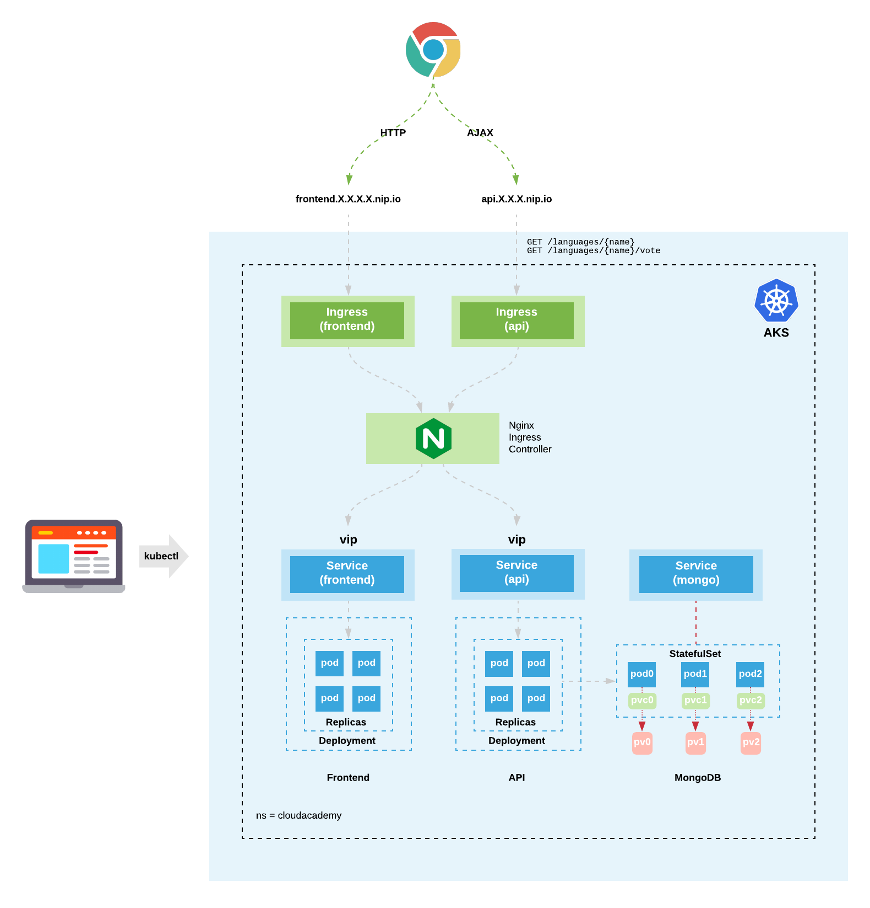
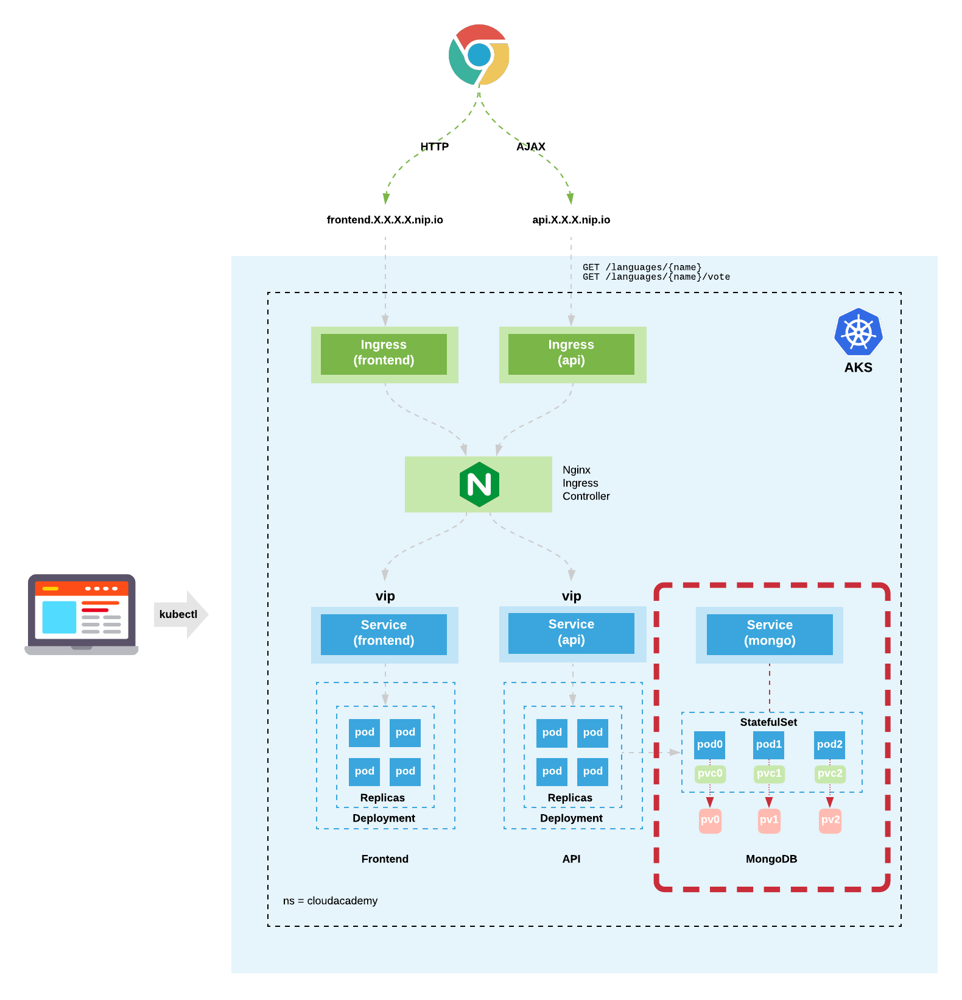
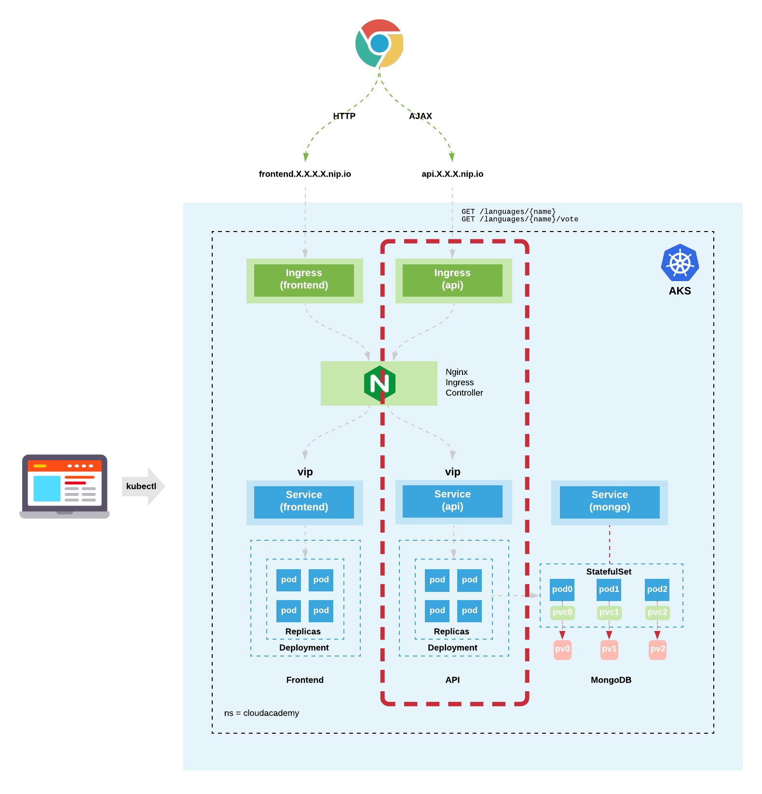

# AKS VoteApp Deployment Instructions

The following instructions are used to demonstrate how to provision an AKS cluster on Azure and deploy a cloud native application into it.

:metal: 

The cloud native application is architected using microservices and is presented to the user as a web application. The application frontend provides the end-user with the ability to vote on one of 6 programming languages: C#, Python, JavaScript, Go, Java, and/or NodeJS. Voting results in AJAX calls being made from the browser to an API which in turn then saves the results into a MongoDB database.


Along the way, you'll get to see how to work with the following AKS cluster resources:
* Pods
* ReplicaSets
* Deployments
* Services
* StatefulSets
* PersistentVolumes
* PersistentVolumeClaims
* IngressController
* Ingress



# STEP 1:
Create a new AKS cluster

## STEP 1.1:

Define the name of the cluster and the azure resource group it will be allocated in

```
CLUSTER_NAME=akstest
RESOURCE_GROUP=aks
VNET_NAME=cloudacademy-aks-vnet
```

## STEP 1.2:

Create a new service principal. The AKS cluster will later be created with this.

```
SP=$(az ad sp create-for-rbac --name spdemocluster --skip-assignment)

APPID=$(echo $SP | jq -r .appId)
PASSWD=$(echo $SP | jq -r .password)

echo APPID: $APPID
echo PASSWD: $PASSWD
```

## STEP 1.3:

Create a new vnet and subnet for the AKS cluster

```
az network vnet create \
    --name $VNET_NAME \
    --resource-group $RESOURCE_GROUP \
    --address-prefixes 10.0.0.0/8 \
    --subnet-name aks-subnet \
    --subnet-prefix 10.240.0.0/16
```

## STEP 1.4:

Assign the contributor role to the service principal scoped on the vnet previously created

```
VNETID=$(az network vnet show \
  --name $VNET_NAME \
  --resource-group $RESOURCE_GROUP \
  --query id \
  -o tsv)

echo VNETID: $VNETID

az role assignment create \
  --assignee $APPID \
  --scope $VNETID \
  --role Contributor
```

## STEP 1.5:

Create the AKS cluster and place it in the vnet subnet previously created

```
SUBNETID=$(az network vnet subnet show \
  --name aks-subnet \
  --resource-group $RESOURCE_GROUP \
  --vnet-name $VNET_NAME \
  --query id \
  -o tsv)

echo SUBNETID: $SUBNETID

az aks create \
  --name $CLUSTER_NAME \
  --resource-group $RESOURCE_GROUP \
  --node-count 2 \
  --node-vm-size Standard_B2ms \
  --vm-set-type VirtualMachineScaleSets \
  --kubernetes-version 1.15.10 \
  --network-plugin azure \
  --service-cidr 10.0.0.0/16 \
  --dns-service-ip 10.0.0.10 \
  --docker-bridge-address 172.17.0.1/16 \
  --vnet-subnet-id $SUBNETID \
  --generate-ssh-keys \
  --network-policy azure \
  --service-principal $APPID \
  --client-secret $PASSWD 
```

This takes between **5-10 minutes** to complete so sit back and relax, its major chill time :+1:

Congrats!! 
You've just baked yourself a fresh AKS Kubernetes cluster!!

# STEP 2:

Test the kubectl client cluster authencation

```
az aks get-credentials -g aks --name akstest --admin
kubectl get nodes
```

```
kubectl config view
kubectl config get-contexts
kubectl config current-context
```

# STEP 3:

Install the Nginx Ingress Controller. This will allow us to direct inbound exteranl calls to the Frontend and API services that will be deployed into the AKS cluster.

## STEP 3.1:

Create the ```nginx-ingress``` namespace - holds the Nginx Ingress Controller components.

```
cat << EOF | kubectl apply -f -
apiVersion: v1
kind: Namespace
metadata:
  name: nginx-ingress
  labels:
    name: nginx-ingress
EOF
```

## STEP 3.2:

Use Helm to install the Nginx Ingress Controller.

Notes:
1. The ```helm``` client needs to be installed locally
2. This has beem successfully tested with ```helm``` version v3.0.2
3. The ```helm``` client authenticates to the AKS cluster using the same ```~/.kube/config``` credentials established earlier

```
helm version
helm repo add stable https://kubernetes-charts.storage.googleapis.com/
helm repo update
helm search repo stable
helm install aks-nginx-ingress stable/nginx-ingress --namespace nginx-ingress
```

## STEP 3.3:

Query the Nginx Ingress Controller and determine the public ip address that has been assigned to it.

Wait until the Nginx Ingress Controller has been allocated a public IP address

```
kubectl get svc aks-nginx-ingress-controller -n nginx-ingress --watch
```

Use ```Ctrl-C``` key sequence to exit the watch

Notes:
1. The public IP address will be used to create both the API and Frontend service FQDNs used later on
2. The API FQDN will be used to within the API's Ingress resource for host based path routing
3. The Frontend FQDN will be used to within the Frontend's Ingress resource for host based path routing
4. The https://nip.io/ dynamic DNS service is being used to provide wildcard DNS

```
kubectl get svc aks-nginx-ingress-controller -n nginx-ingress -o json

INGRESS_PUBLIC_IP=$(kubectl get svc aks-nginx-ingress-controller -n nginx-ingress -o=jsonpath='{.status.loadBalancer.ingress[0].ip}')

echo INGRESS_PUBLIC_IP: $INGRESS_PUBLIC_IP

API_PUBLIC_FQDN=api.$INGRESS_PUBLIC_IP.nip.io
FRONTEND_PUBLIC_FQDN=frontend.$INGRESS_PUBLIC_IP.nip.io

echo API_PUBLIC_FQDN: $API_PUBLIC_FQDN
echo FRONTEND_PUBLIC_FQDN: $FRONTEND_PUBLIC_FQDN
```

# STEP 4:

Create the ```cloudacademy``` namespace - holds the main sample cloud native application components

```
cat << EOF | kubectl apply -f -
apiVersion: v1
kind: Namespace
metadata:
  name: cloudacademy
  labels:
    name: cloudacademy
EOF
```

Configure the ```cloudacademy``` namespace to be the default

```
kubectl config set-context --current --namespace cloudacademy
```

# STEP 5:

Deploy MongoDB 3 x ReplicaSet



## STEP 5.1:

Display the available AKS storage classes. We use the default storage class in the following MongoDb deployment.

```
kubectl get storageclass
```

## STEP 5.2:

Create a new Mongo StatefulSet name ```mongo```

Note: security (--auth flag) hasn't been enabled on the MongoDb database - done to make the demonstration quicker.

```
cat << EOF | kubectl apply -f -
apiVersion: apps/v1beta1
kind: StatefulSet
metadata:
  name: mongo
  namespace: cloudacademy
spec:
  serviceName: mongo
  replicas: 3
  template:
    metadata:
      labels:
        role: db
        env: demo
        replicaset: rs0.main
    spec:
      affinity:
        podAntiAffinity:
          preferredDuringSchedulingIgnoredDuringExecution:
          - weight: 100
            podAffinityTerm:
              labelSelector:
                matchExpressions:
                - key: replicaset
                  operator: In
                  values:
                  - rs0.main
              topologyKey: kubernetes.io/hostname
      terminationGracePeriodSeconds: 10
      containers:
        - name: mongo
          image: mongo
          command:
            - "numactl"
            - "--interleave=all"
            - "mongod"
            - "--wiredTigerCacheSizeGB"
            - "0.1"
            - "--bind_ip"
            - "0.0.0.0"
            - "--replSet"
            - "rs0"
          ports:
            - containerPort: 27017
          volumeMounts:
            - name: mongodb-persistent-storage-claim
              mountPath: /data/db
  volumeClaimTemplates:
    - metadata:
        name: mongodb-persistent-storage-claim
      spec:
        accessModes:
          - ReadWriteOnce
        storageClassName: default
        resources:
          requests:
            storage: 0.5Gi
EOF
```

## STEP 5.3:

Examine the Mongo Pods launch ordered sequence

```
kubectl get pods --watch
kubectl get pods
kubectl get pods --show-labels
kubectl get pods -l role=db
```

Use ```Ctrl-C``` key sequence to exit the watch

Display the MongoDB Pods, Persistent Volumes and Persistent Volume Claims

```
kubectl get pod,pv,pvc
```

## STEP 5.4:

Create a new Headless Service for Mongo named ```mongo```

```
cat << EOF | kubectl apply -f -
apiVersion: v1
kind: Service
metadata:
  name: mongo
  namespace: cloudacademy
  labels:
    role: db
    env: demo
spec:
  ports:
  - port: 27017
    targetPort: 27017
  clusterIP: None
  selector:
    role: db
EOF
```

## STEP 5.5:

Examine the Mongo Headless Service

```
kubectl get svc
```

Examine the DNS records for the Mongo Headless Service

```
kubectl run --generator=run-pod/v1 --rm utils -it --image eddiehale/utils bash
```

Within the new utils container run the following DNS queries

```
host mongo
for i in {0..2}; do host mongo-$i.mongo; done
exit
```

## STEP 5.6:

On the ```mongo-0``` pod, launch the ```mongo``` shell

```
kubectl exec -it mongo-0 mongo
```

Initialise the mongo database replica set

```
rs.initiate();
rs.add("mongo-1.mongo:27017");
rs.add("mongo-2.mongo:27017");
cfg = rs.conf();
cfg.members[0].host = "mongo-0.mongo:27017";
rs.reconfig(cfg, {force: true});

exit
```

```
kubectl exec -it mongo-0 -- mongo --eval "rs.status()"
```

## STEP 5.7:

Load the initial voting app data into the Mongo database

```
cat << EOF | kubectl exec -it mongo-0 mongo
use langdb;
db.languages.insert({"name" : "csharp", "codedetail" : { "usecase" : "system, web, server-side", "rank" : 5, "compiled" : false, "homepage" : "https://dotnet.microsoft.com/learn/csharp", "download" : "https://dotnet.microsoft.com/download/", "votes" : 0}});
db.languages.insert({"name" : "python", "codedetail" : { "usecase" : "system, web, server-side", "rank" : 3, "script" : false, "homepage" : "https://www.python.org/", "download" : "https://www.python.org/downloads/", "votes" : 0}});
db.languages.insert({"name" : "javascript", "codedetail" : { "usecase" : "web, client-side", "rank" : 7, "script" : false, "homepage" : "https://en.wikipedia.org/wiki/JavaScript", "download" : "n/a", "votes" : 0}});
db.languages.insert({"name" : "go", "codedetail" : { "usecase" : "system, web, server-side", "rank" : 12, "compiled" : true, "homepage" : "https://golang.org", "download" : "https://golang.org/dl/", "votes" : 0}});
db.languages.insert({"name" : "java", "codedetail" : { "usecase" : "system, web, server-side", "rank" : 1, "compiled" : true, "homepage" : "https://www.java.com/en/", "download" : "https://www.java.com/en/download/", "votes" : 0}});
db.languages.insert({"name" : "nodejs", "codedetail" : { "usecase" : "system, web, server-side", "rank" : 20, "script" : false, "homepage" : "https://nodejs.org/en/", "download" : "https://nodejs.org/en/download/", "votes" : 0}});

db.languages.find().pretty();
EOF
```

## STEP 5.8:

Confirm data has been loaded correctly

```
kubectl exec -it mongo-0 -- mongo langdb --eval "db.languages.find().pretty()"
```

# STEP 6:



Deploy the API consisting of a Deployment, Service, and Ingress:

## STEP 6.1:

Create a secret to store the mongodb connection credentials

Note: this is for demonstration purposes only - security (auth) hasn't been enabled on the MongoDb database.

```
cat << EOF | kubectl apply -f -
apiVersion: v1
kind: Secret
metadata:
  name: mongodb-secret
  namespace: cloudacademy
data:
  username: YWRtaW4=
  password: cGFzc3dvcmQ=
EOF
```

API: create **deployment** resource

```
cat << EOF | kubectl apply -f -
apiVersion: apps/v1
kind: Deployment
metadata:
  name: api
  namespace: cloudacademy
  labels:
    role: api
    env: demo
spec:
  replicas: 4
  strategy:
    type: RollingUpdate
    rollingUpdate:
      maxSurge: 1
      maxUnavailable: 25%
  selector:
    matchLabels:
      role: api
  template:
    metadata:
      labels:
        role: api
    spec:
      containers:
      - name: api
        image: cloudacademydevops/api:v2
        imagePullPolicy: Always
        env:
          - name: MONGO_CONN_STR
            value: mongodb://mongo-0.mongo,mongo-1.mongo,mongo-2.mongo:27017/langdb?replicaSet=rs0
          - name: MONGO_USERNAME
            valueFrom:
              secretKeyRef:
                name: mongodb-secret
                key: username
          - name: MONGO_PASSWORD
            valueFrom:
              secretKeyRef:
                name: mongodb-secret
                key: password
        ports:
        - containerPort: 8080
        livenessProbe:
          httpGet:
            path: /ok
            port: 8080
          initialDelaySeconds: 2
          periodSeconds: 5
        readinessProbe:
          httpGet:
             path: /ok
             port: 8080
          initialDelaySeconds: 5
          periodSeconds: 5
          successThreshold: 1
EOF
```

## STEP 6.2:

API: create **service** resource

```
cat << EOF | kubectl apply -f -
apiVersion: v1
kind: Service
metadata:
  name: api
  namespace: cloudacademy
  labels:
    role: api
    env: demo
spec:
  ports:
   - protocol: TCP
     port: 8080
  selector:
    role: api
EOF
```

## STEP 6.3:

API: create **ingress** resource

```
cat << EOF | kubectl apply -f -
apiVersion: extensions/v1beta1
kind: Ingress
metadata:
  annotations:
    kubernetes.io/ingress.class: nginx
  name: api
  namespace: cloudacademy
spec:
  rules:
    - host: $API_PUBLIC_FQDN
      http:
        paths:
          - backend:
              serviceName: api
              servicePort: 8080
            path: /
EOF
```

## STEP 6.4:

- Examine the rollout of the API deployment
- Examine the pods to confirm that they are up and running
- Examine the API pod log to see that it has successfully connected to the MongoDB replicaset
- Examine the API service details

```
kubectl rollout status deployment api
kubectl get pods
kubectl get pods -l role=api
kubectl logs API_POD_NAME_HERE
kubectl get svc
```

## STEP 6.5:

Test the API route url - test the ```/ok```, ```/languages```, and ```/languages/{name}``` endpoints

```
curl -s $API_PUBLIC_FQDN/ok
```

Note: The following commands leverage the [jq](https://stedolan.github.io/jq/) utility to format the json data responses

```
curl -s $API_PUBLIC_FQDN/languages | jq .
curl -s $API_PUBLIC_FQDN/languages/go | jq .
curl -s $API_PUBLIC_FQDN/languages/java | jq .
curl -s $API_PUBLIC_FQDN/languages/nodejs | jq .
```

# STEP 7:


Create a new frontend Deployment

Notes: 
1. The value stored in the ```$API_PUBLIC_FQDN``` variable is injected into the frontend container's ```REACT_APP_APIHOSTPORT``` environment var - this tells the frontend where to send browser initiated API AJAX calls

## STEP 7.1:

Frontend: create **deployment** resource

```
cat << EOF | kubectl apply -f -
apiVersion: apps/v1
kind: Deployment
metadata:
  name: frontend
  namespace: cloudacademy
  labels:
    role: frontend
    env: demo
spec:
  replicas: 4
  strategy:
    type: RollingUpdate
    rollingUpdate:
      maxSurge: 1
      maxUnavailable: 25%
  selector:
    matchLabels:
      role: frontend
  template:
    metadata:
      labels:
        role: frontend
    spec:
      containers:
      - name: frontend
        image: cloudacademydevops/frontend:v10
        imagePullPolicy: Always
        env:
          - name: REACT_APP_APIHOSTPORT
            value: $API_PUBLIC_FQDN
        ports:
        - containerPort: 8080
        livenessProbe:
          httpGet:
            path: /ok
            port: 8080
          initialDelaySeconds: 2
          periodSeconds: 5
        readinessProbe:
          httpGet:
             path: /ok
             port: 8080
          initialDelaySeconds: 5
          periodSeconds: 5
          successThreshold: 1
EOF
```

## STEP 7.2:

Frontend: create **service** resource

```
cat << EOF | kubectl apply -f -
apiVersion: v1
kind: Service
metadata:
  name: frontend
  namespace: cloudacademy
  labels:
    role: frontend
    env: demo
spec:
  ports:
   - protocol: TCP
     port: 8080
  selector:
    role: frontend
EOF
```

## STEP 7.3:

Frontend: create **ingress** resource

```
cat << EOF | kubectl apply -f -
apiVersion: extensions/v1beta1
kind: Ingress
metadata:
  annotations:
    kubernetes.io/ingress.class: nginx
  name: frontend
  namespace: cloudacademy
spec:
  rules:
    - host: $FRONTEND_PUBLIC_FQDN
      http:
        paths:
          - backend:
              serviceName: frontend
              servicePort: 8080
            path: /
EOF
```

## STEP 7.4:

Examine the rollout of the Frontend Deployment

```
kubectl rollout status deployment frontend
kubectl get pods
kubectl get pods -l role=frontend
```

## STEP 7.5:

Use the ```curl``` command to test the application via the frontend route url

```
curl -s -I $FRONTEND_PUBLIC_FQDN
curl -s -i $FRONTEND_PUBLIC_FQDN
```

Now test the full end-to-end application using the Chrome browser...

Note: Use the Developer Tools within the Chrome browser to record, filter, and observe the AJAX traffic (XHR) which is generated when any of the +1 vote buttons are clicked.


# STEP 8

Query the MongoDb database directly to observe the updated vote data.

```
kubectl exec -it mongo-0 -- mongo langdb --eval "db.languages.find().pretty()"
```

# STEP 9

Setup and install Network Policies to control pod-to-pod traffic

# STEP 9.1

Default deny all network policy for pod-to-pod traffic within the ```cloudacademy``` namespace

```
cat << EOF | kubectl apply -f -
apiVersion: networking.k8s.io/v1
kind: NetworkPolicy
metadata:
  name: default-deny-all
  namespace: cloudacademy
spec:
  podSelector: {}
  policyTypes:
  - Ingress
EOF
```

# STEP 9.2

Allow mongo-to-mongo pod traffic, required for MongoDb data replication

```
cat << EOF | kubectl apply -f -
kind: NetworkPolicy
apiVersion: networking.k8s.io/v1
metadata:
  name: allow-from-mongo-to-mongo
  namespace: cloudacademy
spec:
  podSelector:
    matchLabels:
      role: db
  ingress:
  - from:
      - podSelector:
          matchLabels:
            role: db
EOF
```

# STEP 9.3

Allow api-to-mongo pod traffic, required to allow the API to read/write data into the MongoDb database

```
cat << EOF | kubectl apply -f -
kind: NetworkPolicy
apiVersion: networking.k8s.io/v1
metadata:
  name: allow-from-api-to-mongo
  namespace: cloudacademy
spec:
  podSelector:
    matchLabels:
      role: db
  ingress:
  - from:
      - podSelector:
          matchLabels:
            role: api
EOF
```

# STEP 9.4

Allow ingress-to-api pod traffic, required to allow API ajax calls from the browser

```
cat << EOF | kubectl apply -f -
kind: NetworkPolicy
apiVersion: networking.k8s.io/v1
metadata:
  name: allow-from-ingress-to-api
  namespace: cloudacademy
spec:
  podSelector:
    matchLabels:
      role: api
  ingress:
  - from:
      - podSelector:
          matchLabels:
            app: nginx-ingress
        namespaceSelector:
          matchLabels:
            name: nginx-ingress
EOF
```

# STEP 9.5

Allow ingress-to-frontend pod traffic, required to allow the frontend (html, js, css) to be requested by the browser

```
cat << EOF | kubectl apply -f -
kind: NetworkPolicy
apiVersion: networking.k8s.io/v1
metadata:
  name: allow-from-ingress-to-frontend
  namespace: cloudacademy
spec:
  podSelector:
    matchLabels:
      role: frontend
  ingress:
  - from:
      - podSelector:
          matchLabels:
            app: nginx-ingress
        namespaceSelector:
          matchLabels:
            name: nginx-ingress
EOF
```

# Step 10

Setup and configure an AKS virtual pool

## Step 10.1

Create a new virtual pool subnet in the same vnet that the cluster was provisioned in.

```
az network vnet subnet create \
    --resource-group $RESOURCE_GROUP \
    --vnet-name $VNET_NAME \
    --name aks-subnet-virtnode \
    --address-prefixes 10.241.0.0/16
```

## Step 10.2

Enable virtual pools

```
az aks enable-addons \
  --name $CLUSTER_NAME \
  --resource-group $RESOURCE_GROUP \
  --addons virtual-node \
  --subnet-name aks-subnet-virtnode
```

## Step 10.3

Test to see if virtual pool is now available

```
kubectl get nodes
```

# STEP 11

When you've finished with the AKS cluster and no longer need tear it down to avoid ongoing charges!!
